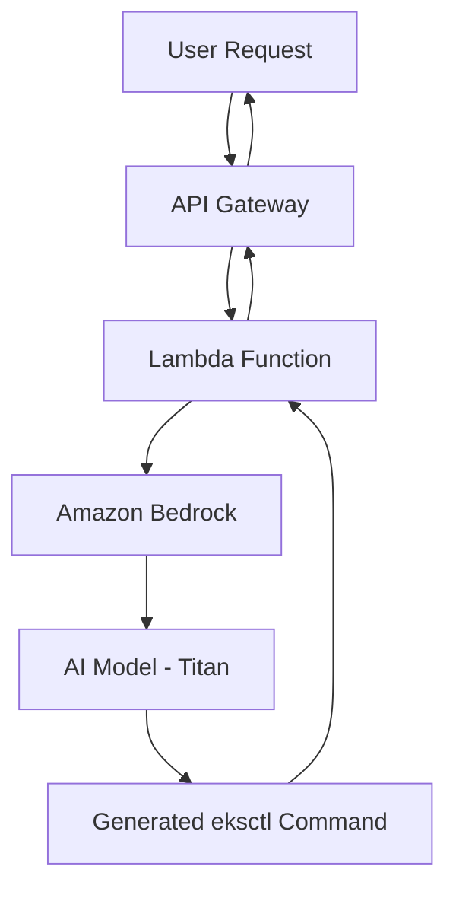

# 🤖 GenAI EKS Command Generator


An intelligent, serverless solution for generating production-ready AWS EKS (eksctl) commands using Amazon Bedrock foundation models. This project leverages AI to transform natural language descriptions into precise Kubernetes cluster deployment commands.

## 🏗️ Architecture Overview



## ⚙️ How It Works

1. **Input**: User sends a JSON prompt to the API Gateway endpoint
2. **Processing**: Lambda function parses the prompt and builds a structured request
3. **AI Generation**: Amazon Bedrock Titan model generates the eksctl command
4. **Output**: Production-ready eksctl command returned via API Gateway

## 🚀 Features

- ✅ **Serverless Architecture**: No infrastructure to manage
- ✅ **AI-Powered**: Uses Amazon Bedrock Titan models
- ✅ **Production Ready**: Generates valid eksctl commands
- ✅ **RESTful API**: Easy integration via API Gateway
- ✅ **Cost Effective**: Pay-per-use pricing model
- ✅ **Scalable**: Automatically scales with demand

## 📋 Prerequisites

Before deploying this solution, ensure you have:

- **AWS Account** with appropriate permissions
- **AWS CLI** configured with credentials
- **Terraform** v1.0+ installed
- **Amazon Bedrock** access enabled in your region
- **IAM Permissions** for Lambda, API Gateway, and Bedrock

## Deploy
```
*****Clone the repo****
Ensure You have AWS Credentials/OIDC for deployment
cd terraform
terraform init
terraform plan
terraform apply
```

## Test Lambda (local CLI)
```
aws lambda invoke \
  --function-name eks-genai-handler \
  --region ap-southeast-2 \
  --cli-binary-format raw-in-base64-out \
  --payload file://payload.json \
  output.json

cat output.json
```


## Test API Gateway
```
curl -X POST \
  -H "Content-Type: application/json" \
  -d '{"prompt":"Create an EKS cluster with two managed node groups in ap-southeast-2"}' \
  https://<your-api-id>.execute-api.ap-southeast-2.amazonaws.com/dev/generate
```

## Output
```
# eksctl create cluster --name=eksdemo1 --region=ap-southeast-2 --zones=ap-southeast-2a,ap-southeast-2b --without-nodegroup
```

## Future improvements
```
Remove occasional "Action:" prefix from model.

Add API authentication.

Add frontend UI.
```

## Contributions
Feel free to fork, open issues, or submit PRs!
